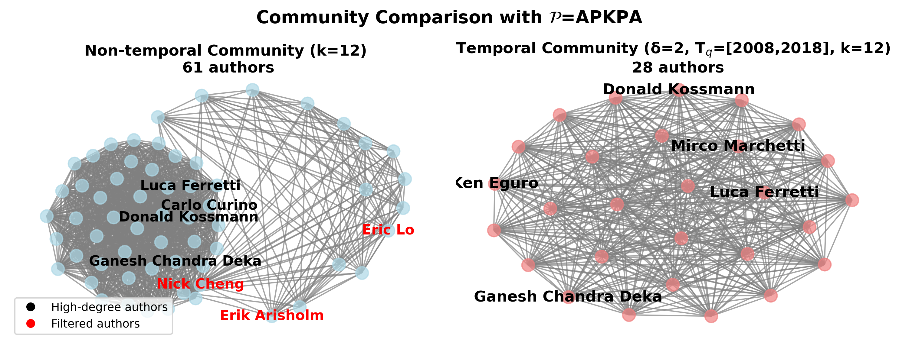

# Implementation for THIN Community Search

## Requirements
- Python 3.10+
- pandas, pyarrow

Install:
```
pip install -r requirements.txt
```

## Data layout
Expected folder layout under `data`:
```
data/<dataset>/edges.parquet
data/<dataset>/nodes.parquet   # optional (for labels)
```

## Run the Code
Use `run.py` with three subcommands.

- Online search (CSW/ICE)
  ```
  # CSW (source is a dataset name under data)
  python run.py search dblp --meta-path "[0,1,-1,-0]" --k 2 --delta 3 --t-start 1996 --t-end 1999

  # ICE
  python run.py search dblp --meta-path "[0,1,-1,-0]" --k 2 --delta 3 --t-start 1996 --t-end 1999 --mode ice
  ```

- Build index
  ```
  python run.py index-build dblp --meta-path "[0,1,-1,-0]" --t-start 1995 --t-end 2000
  ```

- Query index
  ```
  python run.py index-query idx/dblp_0_1_-1_0_1995_2000_index.json --k 2 --delta 3 --t-start 1996 --t-end 1999
  ```

Notes:
- `source` can be a dataset name under `data/` (recommended), a directory containing `edges.parquet`, or a direct `edges.parquet` file path.
- Index JSON is written to `idx/` by default.

## Arguments

Common terms:
- meta-path: symmetric sequence like `[0,1,-1,-0]` (even length). Positive = stored direction, negative = reverse. Numbers are `edge_type` ids.
- time: integer timestamps; `[t_start, t_end]` denotes an inclusive interval.

search
- `source`: dataset name under `data/`, a directory containing `edges.parquet`, or a direct `edges.parquet` path.
- `--meta-path`: symmetric meta-path (e.g., `[0,1,-1,-0]`).
- `--k`: k-core threshold (integer ≥ 1).
- `--delta`: window width for online search (inclusive, window = `t .. t+delta`).
- `--t-start`, `--t-end`: overall time range to scan windows within.
- `--mode`: `csw` (rebuild per window) or `ice` (incremental update), default `csw`.

index-build
- `source`: dataset name under `data/`, a directory containing `edges.parquet`, or a direct `edges.parquet` path.
- `--meta-path`: symmetric meta-path.
- `--t-start`, `--t-end`: optional time range to limit index build (inclusive). If omitted, build on full range present in data.
- `--out`: output JSON path; if omitted, a file is created under `idx/` with a name derived from dataset, meta-path and range.

index-query
- `index_json`: path to exported index JSON.
- `--k`: minimal core number of interest.
- `--delta`: maximal allowed interval span for core intervals (i.e., `t_end - t_start ≤ delta`).
- `--t-start`, `--t-end`: query window `[q_s, q_e]`; only index intervals fully contained in this window are returned.

## Data sources

Popular temporal/dynamic graph datasets:
- Stanford Large Network Dataset Collection (SNAP): https://snap.stanford.edu/data/
- Network Data Repository: https://networkrepository.com/
- DBLP data (XML dump): https://dblp.org/xml/

## Case study figure

This figure reproduces the case study from the paper's Experiments section: DBLP with k=2 and meta-path A–P–K–P–A (APKPA) over 10 database-related keywords. With T_q = [2008, 2018] and δ = 2, the temporal model reduces the community from 61 to 28 authors. The right panel (temporal) is more concentrated than the left (non-temporal), illustrating how temporal constraints prune temporally distant connections and reveal a more cohesive, time-aligned core.




 
